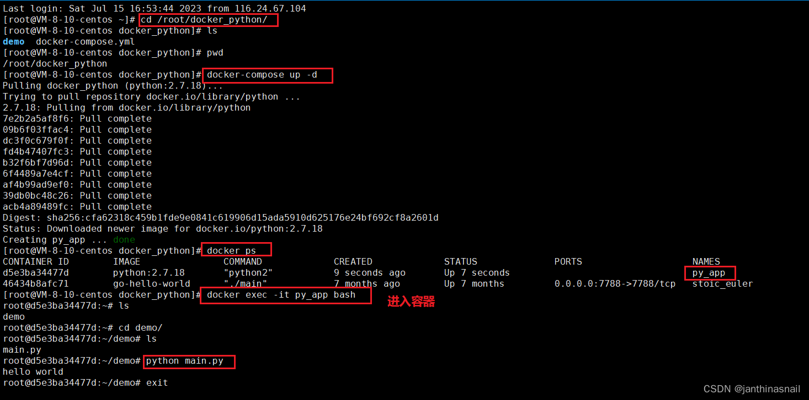

/root/docker_python目录结构：
```bash
.
|-- demo
|   `-- main.py
`-- docker-compose.yml
```

main.py内容：
```python
# coding=utf-8
# -*- coding: utf-8 -*-
 
if __name__ == '__main__':
    print("hello world")
```

docker-compose.yml内容：
```yaml
version: "3"
services:
  docker_python:
    image: python:2.7.18
    container_name: py_app
    working_dir: "/root"
    restart: always
    volumes:
      - "/root/docker_python/demo:/root/demo"
    networks:
      - py_net
    environment:
      - TZ=Asia/Shanghai
    stdin_open: true
    tty: true
networks:
  py_net:
    #driver: bridge
```

其中 stdin_open 相当于 run 命令中的 -d,

其中 tty 相当于 run 命令中的 -i

```yaml
stdin_open: true
tty: true
```

其中networks可以使用已创建网络，假设xxx为已创建的网络
```yaml
networks:
  xxx:
    external: true
```

设置容器时区
```yaml
environment:
      - TZ=Asia/Shanghai
```


补充：
```
若没有在文件中没有写入“environment: - TZ=Asia/Shanghai”，

我们还可以进入容器中设置时区
```

```bash
# 注：以下命令都是进入容器后执行的
 
# 如果没有设置时区，默认UTC
# 使用date查看时间，可以看到UTC
 
# 设置CST-8
cp /usr/share/zoneinfo/Asia/Shanghai /etc/localtime
# 使用date查看时间，可以看到CST
 
# 恢复默认
rm /etc/localtime
# 使用date查看时间，可以看到UTC
```

服务器系统时间同步：[Linux 修改系统时间的两种方式_linux 修改时间_会踢球的程序源的博客-CSDN博客](https://blog.csdn.net/dyuan134/article/details/130201683)
