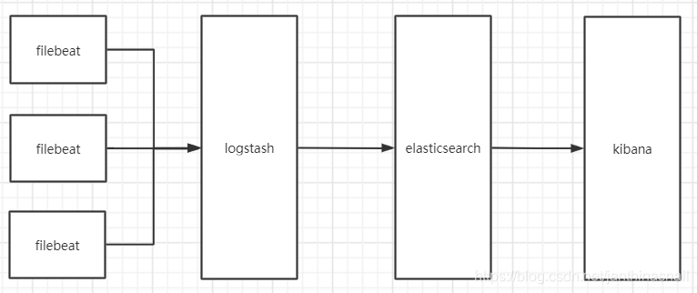
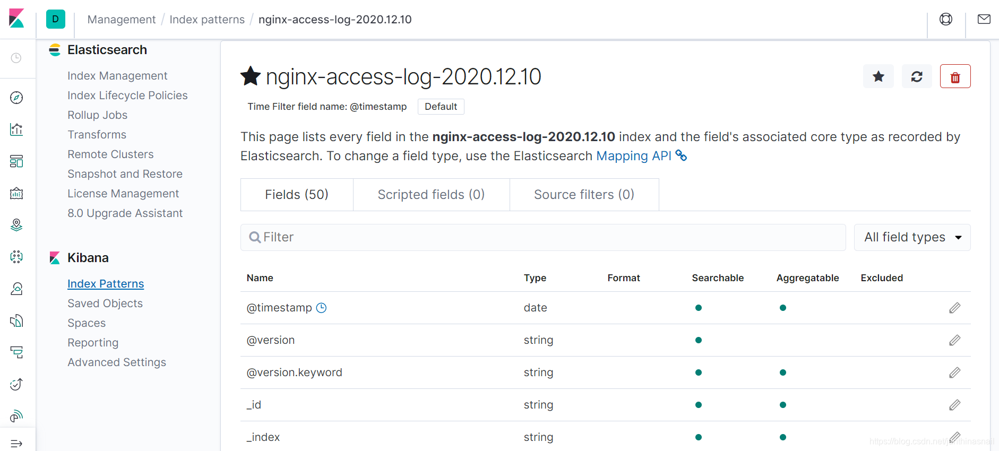

环境
centos7两台：192.168.186.128和192.168.186.129（以下简称128和129）

128安装：Filebeat、Logstash、Nginx

129安装：Elasticsearch、Kibana

说明：

1、Logstash本来要放在129机器上，由于内存和硬盘大小有限，暂时将放在128这台机器上进行测试

2、Nginx只是做产生日志用的，这里暂不写Nginx的搭建步骤

3、架构图


安装软件Filebeat+ELK（Elasticsearch、Logstash、Kibana）
一、安装Elasticsearch并启动（以下用es进行简称）

1、下载并安装
```bash
# 下载
wget https://artifacts.elastic.co/downloads/elasticsearch/elasticsearch-7.6.1-linux-x86_64.tar.gz
 
# 解压
tar -xf elasticsearch-7.6.1-linux-x86_64.tar.gz -C /usr/local/
 
# 重命名
mv elasticsearch-7.6.1/ elasticsearch
 
# 创建软连接
ln -s  /usr/local/elasticsearch/bin/elasticsearch /usr/local/bin/elasticsearch
ln -s  /usr/local/elasticsearch/bin/elasticsearch-env /usr/local/bin/elasticsearch-env
```

2、配置

2.1、创建es的用户、数据目录和日志目录
```bash
# 创建用户组
groupadd es
 
# 创建es用户
useradd -M es -g es
 
# 创建es的数据目录和日志目录
mkdir -p /var/data/es/data /var/data/es/log
 
# 给目录添加所属组
chown -R es:es /usr/local/elasticsearch/
chown -R es.es /var/data/es/data/
chown -R es.es /var/data/es/log
```

2.2、/usr/local/elasticsearch/config/elasticsearch.yml的配置内容如下
```bash
cluster.name: cluster-1
node.name: node-1
path.data: /var/data/es/data
path.logs: /var/data/es/log
bootstrap.memory_lock: false
bootstrap.system_call_filter: false
network.host: 192.168.186.129
http.port: 9200
http.cors.enabled: true
http.cors.allow-origin: "*"
cluster.initial_master_nodes: ["node-1"]
```

2.3、启动
```bash
# 方式1：启动elasticsearch,网上找到的启动方式，貌似不管用
elasticsearch -Des.insecure.allow.root=true
 
# 方式2：启动elasticsearch
su es
elasticsearch
```

2.4、启动后报错
> 参考  
> https://blog.csdn.net/cbuy888/article/details/103166008  
> https://blog.csdn.net/happyzxs/article/details/89156068  

```bash
# 报错信息
ERROR: [5] bootstrap checks failed
[1]: max file descriptors [4096] for elasticsearch process is too low, increase to at least [65535]
[2]: memory locking requested for elasticsearch process but memory is not locked
[3]: max number of threads [3795] for user [es] is too low, increase to at least [4096]
[4]: max virtual memory areas vm.max_map_count [65530] is too low, increase to at least [262144]
[5]: the default discovery settings are unsuitable for production use; at least one of [discovery.seed_hosts, discovery.seed_providers, cluster.initial_master_nodes] must be configured
ERROR: Elasticsearch did not exit normally - check the logs at /var/data/es/log/cluster-1.log
 
# 逐一解决方案
【1和3】、在/etc/security/limits.conf追加以下内容（注意es为用户名，不填用*代替）
es soft nofile 65535
es hard nofile 65535
es soft nproc 4096
es hard nproc 4096
es hard memlock unlimited
es soft memlock unlimited
 
【2】、编辑/usr/local/elasticsearch/config/elasticsearch.yml
bootstrap.memory_lock: false
bootstrap.system_call_filter: false
 
【4】、在/etc/sysctl.conf中添加下面配置，然后使用命令sysctl -p
vm.max_map_count=262144
 
【5】、修改/usr/local/elasticsearch/config/elasticsearch.yml
cluster.initial_master_nodes: ["node-1"]
```

2.5、使用elasticsearch -d后台启动，访问es，使用curl http://192.168.186.129:9200访问，显示信息如下
```bash
{
  "name" : "node-1",
  "cluster_name" : "cluster-1",
  "cluster_uuid" : "fsRhE84tQBeU36TT2olPzQ",
  "version" : {
    "number" : "7.6.1",
    "build_flavor" : "default",
    "build_type" : "tar",
    "build_hash" : "aa751e09be0a5072e8570670309b1f12348f023b",
    "build_date" : "2020-02-29T00:15:25.529771Z",
    "build_snapshot" : false,
    "lucene_version" : "8.4.0",
    "minimum_wire_compatibility_version" : "6.8.0",
    "minimum_index_compatibility_version" : "6.0.0-beta1"
  },
  "tagline" : "You Know, for Search"
}
```

二、安装Kibana并启动

1、安装及配置
```bash
# 下载
wget https://artifacts.elastic.co/downloads/kibana/kibana-7.6.1-linux-x86_64.tar.gz
 
# 解压
tar -xf kibana-7.6.1-linux-x86_64.tar.gz -C /usr/local/
 
# 重命名
mv kibana-7.6.1-linux-x86_64/ kibana
 
# 配置/usr/local/kibana/config/kibana.yml
server.port: 5601
server.host: "0.0.0.0"
elasticsearch.hosts: ["http://192.168.186.129:9200"]
kibana.index: ".kibana"
 
# 创建软连接
ln -s /usr/local/kibana/bin/kibana /usr/local/bin/
 
# 使用kibana启动报错的话，使用kibana --allow-root启动
kibana
```

2、通过浏览器访问http://192.168.186.129:5601


三、安装Logstash（详见官网https://www.elastic.co/guide/en/logstash/7.x/getting-started-with-logstash.html）

1、如果已经安装了jdk，可忽略这步操作（下面的jdk不是从官方下载的，请去official Oracle distribution官网下载）

```bash
# 下载jdk
wget https://download.java.net/openjdk/jdk14/ri/openjdk-14+36_linux-x64_bin.tar.gz
 
# 解压
tar -xf openjdk-14+36_linux-x64_bin.tar.gz
 
# 移动到/usr/local目录
mv jdk-14 /usr/local/jdk
 
# /etc/profile添加java的相关配置
export JAVA_HOME=/usr/local/jdk
export PATH=$PATH:$JAVA_HOME/bin
 
# 输入java查看
openjdk 14 2020-03-17
OpenJDK Runtime Environment (build 14+36-1461)
OpenJDK 64-Bit Server VM (build 14+36-1461, mixed mode, sharing)
```

2、安装Logstash

```bash
# 下载
wget https://artifacts.elastic.co/downloads/beats/filebeat/logstash-7.6.1.tar.gz
 
# 解压
tar -xf logstash-7.6.1.tar.gz
 
# 移动到/usr/local目录
mv logstash-7.6.1 /usr/local/logstash
 
# 创建软连接
ln -s /usr/local/logstash/bin/logstash /usr/local/bin/
 
# 输入hello进行测试
logstash -e 'input { stdin {} } output { stdout {} }'
 
# 报错，之前下的jdk15，重新下载jdk14，没有报这个问题了
Unrecognized VM option 'UseConcMarkSweepGC'
Error: Could not create the Java Virtual Machine.
Error: A fatal exception has occurred. Program will exit.
 
# 继续执行下面命令，然后输入hello进行测试
logstash -e 'input { stdin {} } output { stdout {} }'
 
# 等出现下面信息输入hello进行测试
The stdin plugin is now waiting for input:
[2020-12-10T13:07:45,663][INFO ][logstash.agent           ] Pipelines running {:count=>1, :running_pipelines=>[:main], :non_running_pipelines=>[]}
[2020-12-10T13:07:46,639][INFO ][logstash.agent           ] Successfully started Logstash API endpoint {:port=>9600}
 
# 输入hello
hello
 
# 显示内容
/usr/local/logstash/vendor/bundle/jruby/2.5.0/gems/awesome_print-1.7.0/lib/awesome_print/formatters/base_formatter.rb:31: warning: constant ::Fixnum is deprecated
{
          "host" => "128",
      "@version" => "1",
    "@timestamp" => 2020-12-10T05:09:16.329Z,
       "message" => "hello"
}
```

四、安装Filebeat

```bash
# 下载
wget https://artifacts.elastic.co/downloads/beats/filebeat/filebeat-7.6.1-linux-x86_64.tar.gz
 
# 解压
tar -xf tar -xf filebeat-7.6.1-linux-x86_64.tar.gz
 
# 移动到/usr/local
mv filebeat-7.6.1-linux-x86_64 /usr/local/filebeat
 
# 创建软连接
ln -s /usr/local/filebeat/filebeat /usr/local/bin/
```

相关配置
五、Logstash配置并启动

1、在/usr/local/logstash/config/test_pipelines.conf写入以下配置(其中test_pipelines.conf是自己定义的文件，名称自己定义就好了)

```bash
input {
    beats { 
        port => "5044"
    }
}
 
output {
    elasticsearch {
    hosts => ["192.168.186.129:9200"]
    index => "nginx-access-log-%{+YYYY.MM.dd}"
  }
}
 
```

2、检查并启动
```bash
# --config.test_and_exit选项的意思是解析配置文件并报告任何错误
logstash -f /usr/local/logstash/config/test_pipelines.conf --config.test_and_exit
 
# 如果logstash已经启动，使用kill -9 logstash进程id
ps aux|grep logstash
kill -9 logstash进程id
 
# --config.reload.automatic选项的意思是启用自动配置加载，以至于每次你修改完配置文件以后无需停止然后重启Logstash
logstash -f /usr/local/logstash/config/test_pipelines.conf --config.reload.automatic
```

六、Filebeat配置并启动

1、修改/usr/local/filebeat/filebeat.yml文件
```bash
filebeat.inputs:
- type: log
  enabled: true
  paths:
    - /usr/local/nginx/logs/*.log # 修改为自己要采集的文件
output.logstash:
  hosts: ["192.168.186.128:5044"] # 修改为自己的ip和port
```

2、启动
`filebeat -e -c /usr/local/filebeat/filebeat.yml -d "publish"`

七、Kibana查看





八、可以加入Kafka集群（略）

相比rabbitmq而言，kafka吞吐量大，而且可以无限扩容。

九、建议

如果机器硬盘和内存足够的话，还是建议使用docker+k8s搭建，后期维护起来方便。

但是由于机器的限制，之前试过用docker搭建esticsearch集群+kibana，机器直接卡死了，所以暂不使用docker搭建环境了。

十、总结

有些技术了解的不是很深入，可能还存在不足的地方，后期还待完善。

分享es的资料https://www.cnblogs.com/wangzhuxing/category/1265051.html

 

参考：https://www.cnblogs.com/cheyunhua/p/11238489.html
