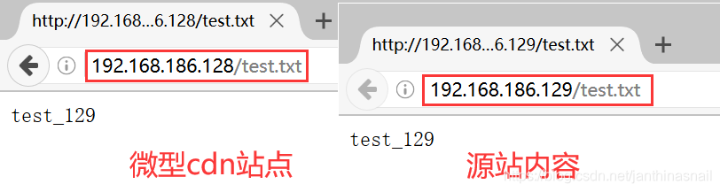
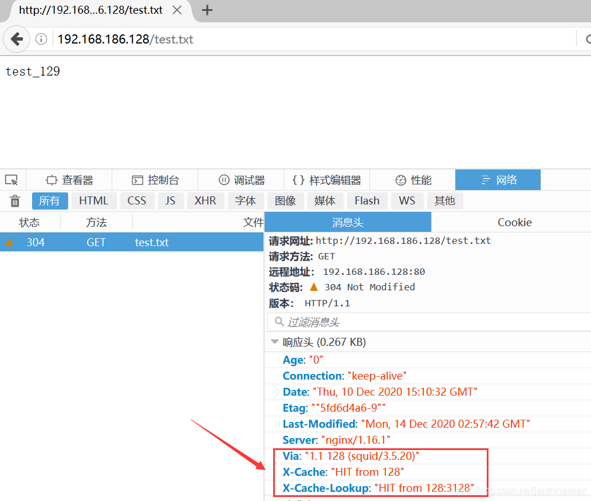

CDN原理
简单了解一下什么是cdn及工作原理，https://blog.csdn.net/xiangzhihong8/article/details/83147542

环境
centos7两台：192.168.186.128和192.168.186.129（以下简称128和129）

128安装：Nginx、Squid

129安装：Nginx

说明：

1、128做cdn，nginx做反向代理，代理到squid。129做源站，提供web服务

2、架构图


一、修改yum镜像源（不想修改，直接跳过这一操作）
```bash
# 备份.repo文件
mkdir /etc/yum.repos.d/bacakup
mv /etc/yum.repos.d/* /etc/yum.repos.d/bacakup
 
# 下载阿里的yum源
wget -O /etc/yum.repos.d/Centos-7.repo http://mirrors.aliyun.com/repo/Centos-7.repo
wget -O /etc/yum.repos.d/epel-7.repo http://mirrors.aliyun.com/repo/epel-7.repo
 
# 清除和新建元数据缓存
yum clear all
yum makecache
```

二、安装nginx

1、安装方式

1.1、方案一：nginx是基于之前搭建好的nginx，见nginx复杂搭建或者nginx简单搭建，或者用你自己搭建好的nginx环境。

1.2、方案二：如果懒得配置的话，就直接使用yum install -y nginx来安装nginx。

2、分别在128和129上安装nginx

2.1、128上安装nginx
```bash
# 安装nginx
yum install -y nginx
 
# 修改nginx配置
vi /etc/nginx/nginx.conf
 
# 配置内容，最主要是修改反向代理的ip,其他的部分我没修改就不写出来了
server {
    location / {
        proxy_pass http://192.168.186.128:3128; 
    }
}
 
# 激活和启动nginx服务
systemctl enable nginx.service
systemctl start nginx.service
```

2.2、129上安装nginx
```bash
# 安装nginx
yum install -y nginx
 
# 修改nginx配置
vi /etc/nginx/nginx.conf
 
# 配置内容，改成你自己的ip
server {
    server_name  192.168.186.129;
    root  /usr/share/nginx/html;
    charset  utf-8;
}
 
# 激活和启动nginx服务
systemctl enable nginx.service
systemctl start nginx.service
 
 
# 可能用到的命令说明
# 重启命令
systemctl restart squid.service
# 停止命令
systemctl stop squid.service
```

2.3、在129上的/usr/share/nginx/html目录，添加一些静态资源，如css、js、html等

我就添加一个test.txt文件，内容为test_129

二、安装squid（详细配置见官网http://www.squid-cache.org/）

```bash
# 安装squid
yum install squid
 
# 配置
vi /etc/squid/squid.conf
 
# 添加以下配置内容（请根据实际情况修改，ip和port）
http_port 3128 accel vhost vport
cache_peer 192.168.186.129 parent 80 0 originserver
 
# 激活和启动squid服务
systemctl enable squid.service
systemctl start squid.service
 
 
# 可能用到的命令说明
# 重启命令
systemctl restart squid.service
# 停止命令
systemctl stop squid.service
```

三、查看效果



最后，分享一下之前看到一篇写squid比较详细的，有时间可以去看看[使用Squid部署代理缓存服务](https://www.linuxprobe.com/chapter-16.html)
