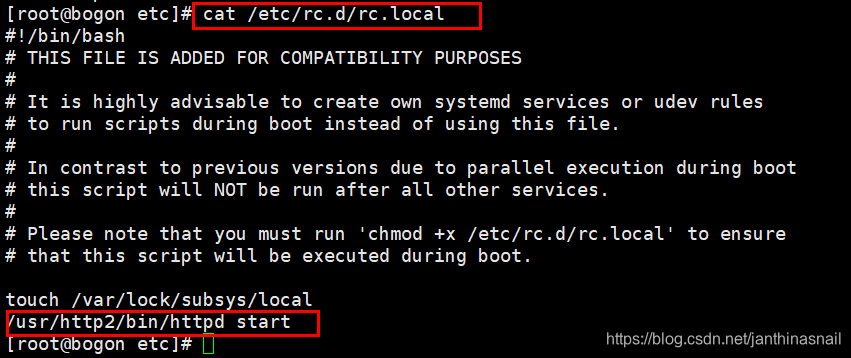

1、安装 gcc、gcc-c++、make等编译工具  
【其中】可以使用yum安装  或者  通过该网址https://www.lmonkey.com/tools/linux下载  

2、apr 、apr-util、httpd、pcre、zlib的.tar.gz源码包安装  
【其中】可以使用wget下载。将apr、apr-util复制到httpd的srclib对应的目录下，如下所示：  
```bash
cp -a /root/lamp/apr /root/httpd/srclib/apr
cp -a /root/lamp/apr-util /root//httpd/srclib/apr-util
```

看报错是否需要安装expat-devel，如果需要yum进行安装  
pcre、zlib安装：直接./configure  
httpd安装：（参考如下）  
```bash
./configure \
--prefix=/usr/local/http2 \
--sysconfdir=/etc/httpd \
--enable-mods-shared=all 
```

```bash
或者
./configure  \
--prefix=/usr/local/apache2  \
--sysconfdir=/usr/local/apache2/etc \
--with-included-apr  \
--enable-so   \
--enable-deflate=shared  \
--enable-expires=shared \
--enable-rewrite=shared  \
--enable-ssl
```

```bash
或者
./configure \
--prefix=/usr/local/apache \
-with-pcre=/usr/local/pcre/bin/pcre-config \
-with-include-apr
```

3、启动httpd服务  
apache httpd启动关闭，以及设置开机启动  
/usr/sbin/httpd -k start或者/usr/sbin/apachectl start  

4、关闭防火墙
```bash
下面是red hat/CentOs7关闭防火墙的命令!
 
1:查看防火状态
 
systemctl status firewalld
 
service  iptables status
 
2:暂时关闭防火墙
 
systemctl stop firewalld
 
service  iptables stop
 
3:永久关闭防火墙
 
systemctl disable firewalld
 
chkconfig iptables off
 
4:重启防火墙
 
systemctl enable firewalld
 
service iptables restart  
 
5:永久关闭后重启
 
//暂时还没有试过
 
chkconfig iptables on
```

5、配置动态获取ip

6、httpd设置为开机自启动  
生成软连接ln -s /usr/sbin/apachectl /bin/apachectl  
自启动配置文件：/etc/rc.d/rc.local  


7、备注：
```bash
httpd安装目录为
/usr/local/xxx
 
过滤显示内容
cat httpd.conf |grep -v '#' | grep -v '^$'|cat -n
 
添加用户
useradd mysql
useradd -r -s /sbin/nologin mysql
 
给文件添加权限
chmod u+x,g+x,o+x /usr/local/mysql
chmod +755 /usr/local/mysql
 
给文件添加用户及用户所在组
chown -R mysql.mysql /usr/local/mysql
 
如无此命令，请安装：
如无此命令安装yum install yum-utils
 
下载软件包、以及依赖到指定目录:
yumdownloader –resolve –destdir=/root/rpm/ net-tools
 
```
