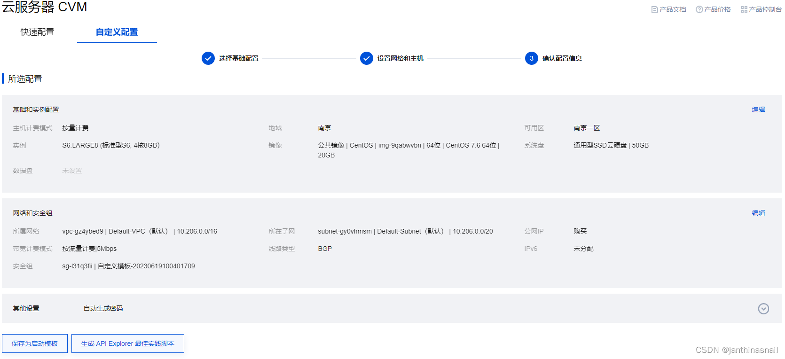
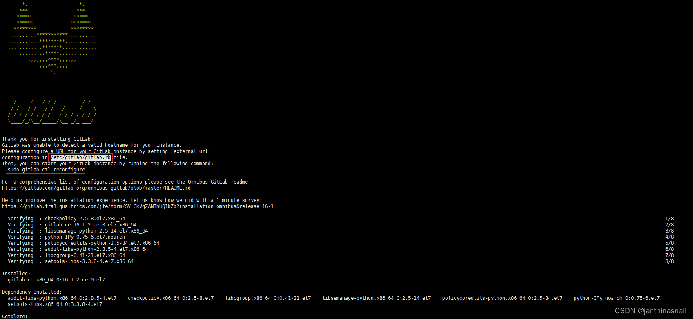
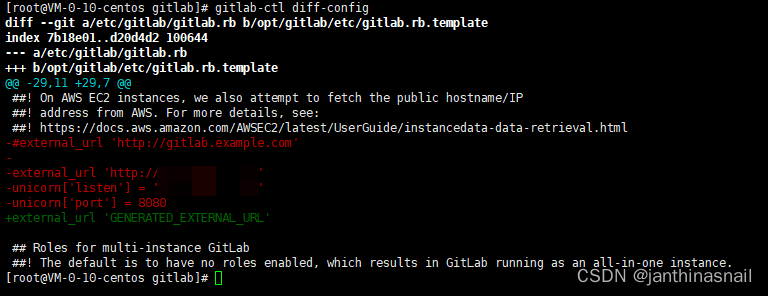
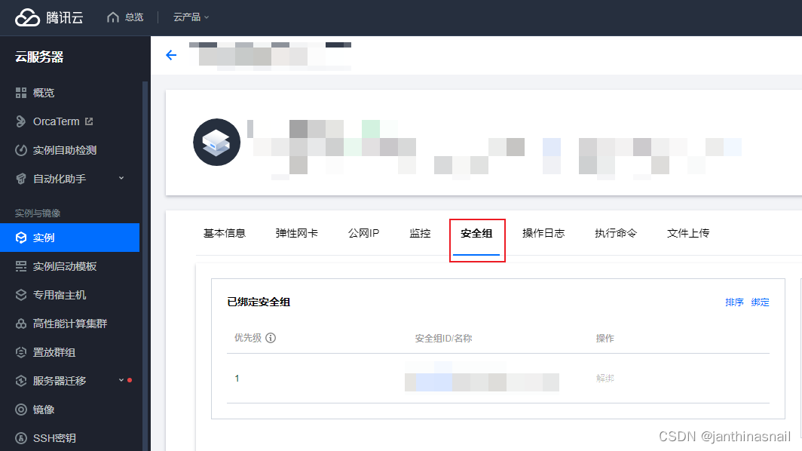
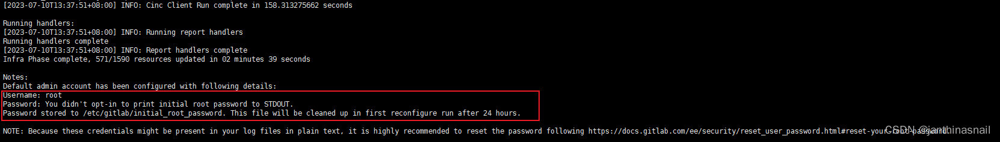
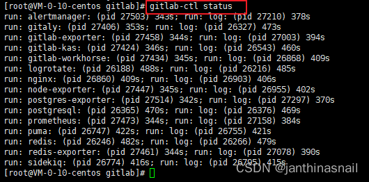
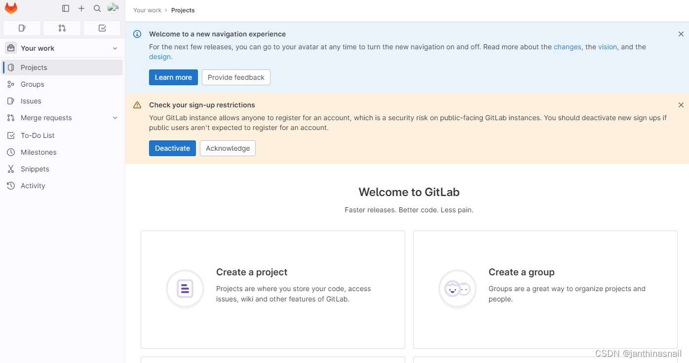

环境要求：4核cpu、8G内存、centos7.6

在腾讯云购买按量付费的服务器用于gitlab安装



使用xshell登录购买的服务器

使用yum安装gitlab

```bash
curl https://packages.gitlab.com/install/repositories/gitlab/gitlab-ce/script.rpm.sh | sudo bash
sudo yum install -y gitlab-ce
```

由于执行“sudo yum install -y gitlab-ce”下载太慢，修改gitlab镜像源

将/etc/yum.repos.d/gitlab-ce.repo中[gitlab_gitlab-ce]的baseurl修改成“https://mirrors.tuna.tsinghua.edu.cn/gitlab-ce/yum/el$releasever/”

```bash
[gitlab_gitlab-ce]
name=gitlab_gitlab-ce
#baseurl=https://packages.gitlab.com/gitlab/gitlab-ce/el/7/$basearch
baseurl=https://mirrors.tuna.tsinghua.edu.cn/gitlab-ce/yum/el$releasever/
repo_gpgcheck=1
gpgcheck=1
enabled=1
gpgkey=https://packages.gitlab.com/gitlab/gitlab-ce/gpgkey
       https://packages.gitlab.com/gitlab/gitlab-ce/gpgkey/gitlab-gitlab-ce-3D645A26AB9FBD22.pub.gpg
sslverify=1
sslcacert=/etc/pki/tls/certs/ca-bundle.crt
metadata_expire=300
 
[gitlab_gitlab-ce-source]
name=gitlab_gitlab-ce-source
baseurl=https://packages.gitlab.com/gitlab/gitlab-ce/el/7/SRPMS
repo_gpgcheck=1
gpgcheck=1
enabled=1
gpgkey=https://packages.gitlab.com/gitlab/gitlab-ce/gpgkey
       https://packages.gitlab.com/gitlab/gitlab-ce/gpgkey/gitlab-gitlab-ce-3D645A26AB9FBD22.pub.gpg
sslverify=1
sslcacert=/etc/pki/tls/certs/ca-bundle.crt
metadata_expire=300
```

生成yum缓存
`yum makecache`

继续执行yum安装gitlab
`sudo yum install -y gitlab-ce`

安装完成  


配置文件目录：/etc/gitlab/

配置文件路径：/etc/gitlab/gitlab.rb

执行命令查看/etc/gitlab/gitlab.rb文件内容：
`cat /etc/gitlab/gitlab.rb |grep -v "#"|grep -v "^$"`

使用vi命令修改/etc/gitlab/gitlab.rb文件

说明：由于版本原因修改unicorn['listen']、unicorn['port']可能不支持，目前只能修改external_url

执行命令:
`gitlab-ctl diff-config`




修改腾讯云的安全组，放开80端口




执行命令：
`gitlab-ctl reconfigure`



查看登录gitlab的密码：cat /etc/gitlab/initial_root_password
`gitlab-ctl status`



浏览器访问http://ip,这个ip就是上面填写的external_url




详细操作见 ：[GitLab - 安装并启动GitLab - osc_aq3v6w0z的个人空间 - OSCHINA - 中文开源技术交流社区](https://my.oschina.net/u/4325773/blog/3339131)  

参考：  
[GitLab首页、文档和下载 - 项目管理和代码托管平台 - OSCHINA - 中文开源技术交流社区](https://www.oschina.net/p/gitlab?hmsr=aladdin1e1)  
[GitLab - 安装并启动GitLab - osc_aq3v6w0z的个人空间 - OSCHINA - 中文开源技术交流社区](https://my.oschina.net/u/4325773/blog/3339131)  
[gitlab-ce修改为清华镜像源](https://www.cnblogs.com/guaguaerhao/p/15775913.html)  
[更换yum源_修改yum源_打心眼里丶的博客-CSDN博客](https://blog.csdn.net/qq_44827057/article/details/118410709)  

cicd参考：  
[GitLab实现CICD自动化部署_gitlab cidi_程序员xiaoQ的博客-CSDN博客](https://blog.csdn.net/weixin_42304232/article/details/115727182)  
[lib/gitlab/ci/templates · master · GitLab.org / GitLab FOSS · GitLab](https://gitlab.com/gitlab-org/gitlab-foss/tree/master/lib/gitlab/ci/templates)  
[前端 - 服务器配置gitlab-runner流程问题总结 - 个人文章 - SegmentFault 思否](https://segmentfault.com/a/1190000041162239?utm_source=sf-similar-article)  

