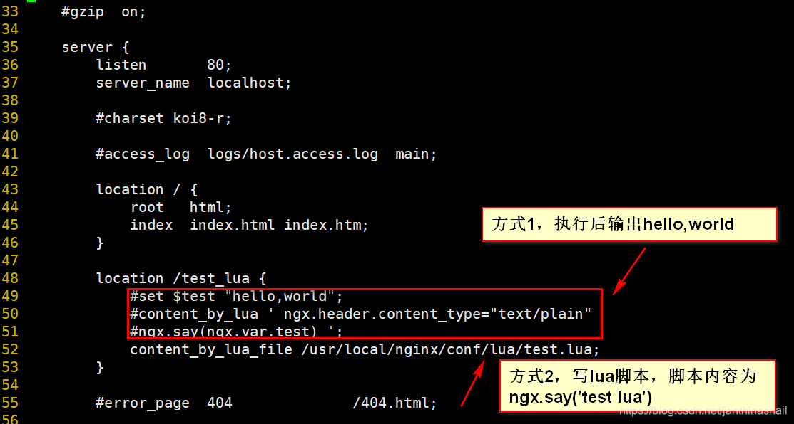

（写在前面：以下是在centos7系统进行软件安装）

一、安装lua（下载地址[Download](https://luajit.org/download.html)）

```bash
# 如需安装依赖，请执行以下命令，否则，跳过
yum install gcc gcc-c++ automake autoconf libtool make gd gd-devel libxslt-devel
```

方式1：通过下载Lua安装包进行安装（本次安装暂未使用此方式进行安装）
```bash
# 安装步骤参考Lua官网：http://www.lua.org/download.html
 
# 下载
curl -R -O http://www.lua.org/ftp/lua-5.4.3.tar.gz
 
# 解压
tar zxf lua-5.4.3.tar.gz
 
# 进入目录
cd lua-5.4.3
 
# 编译安装
make all test 或者 make linux test
make install
```

方式2：通过下载LuaJIT安装包进行安装（LuaJIT比Lua高效）
```bash
# 安装依赖
yum -y install gcc+ gcc-c++ readline-devel
 
# 下载LuaJIT
wget http://luajit.org/download/LuaJIT-2.0.4.tar.gz
 
# 解压
tar -xf LuaJIT-2.0.4.tar.gz
 
# 进入目录
cd LuaJIT-2.0.4
 
# 安装
make install PREFIX=/usr/local/LuaJIT
 
# 在/etc/profile末尾增加以下两行
# 因为LuaJIT的安装目录是/usr/local/LuaJIT
export LUAJIT_LIB=/usr/local/LuaJIT/lib
export LUAJIT_INC=/usr/local/LuaJIT/include
 
# 执行source /etc/profile
source /etc/profile
```

测试lua是否安装成功，编写hello.lua文件，写入print("hello world")，然后使用lua hello.lua执行，结果输出hello world，说明安装成功。

二、下载ngx_devel_kit和lua-nginx-module（[OpenResty详细见官网OpenResty® - 中文官方站](https://openresty.org/cn/)）

ngx_devel_kit：NDK(nginx development kit)模块是一个拓展nginx服务器核心功能的模块,第三方模块开发可以基于它来快速实现。

lua-nginx-module：将Lua的功能嵌入到Nginx HTTP服务器中。该模块是[OpenResty](https://openresty.org/)的核心组件。如果您使用的是此模块，则实际上是在使用OpenResty。

```bash
# 下载ngx_devel_kit
wget https://github.com/simpl/ngx_devel_kit/archive/v0.3.0.tar.gz
 
# 解压
tar -xf v0.3.0.tar.gz
 
# 将解压后的目录移动到/usr/local/src
mv ngx_devel_kit-0.3.0/ /usr/local/src/nginx
 
# 下载lua-nginx-module
wget https://github.com/openresty/lua-nginx-module/archive/v0.10.9rc7.tar.gz
 
# 解压
tar -xf v0.10.9rc7.tar.gz
 
# 将解压后的目录移动到/usr/local/src
mv lua-nginx-module-0.10.9rc7/ /usr/local/src/nginx
```

三、安装nginx（nginx下载地址[nginx: download](http://nginx.org/en/download.html)）

具体配置见官网[Building nginx from Sources](http://nginx.org/en/docs/configure.html)

```bash
# 安装依赖
yum install -y openssl openssl-devel zlib zlib-devel pcre-devel
 
# 下载nginx
wget http://nginx.org/download/nginx-1.14.1.tar.gz
 
# 解压
tar -xf nginx-1.14.1.tar.gz
 
# 进入目录
cd nginx-1.14.1
 
# 编译（这段代码复制别人的，可能会存在问题，与你想安装的配置路径不符，使用前请根据情况修改相关配置路径。
# 由于配置内容有点多，暂时没用这种，只是做简单的测试，不想花太多的时间）
# 部分参数不清楚，请参见https://www.cnblogs.com/whych/p/9521597.html
# 或者直接官方文档http://nginx.org/en/docs/
./configure --prefix=/etc/nginx --sbin-path=/usr/sbin/nginx \ 
--modules-path=/usr/lib64/nginx/modules --conf-path=/etc/nginx/nginx.conf \
--error-log-path=/var/log/nginx/error.log --http-log-path=/var/log/nginx/access.log \
--pid-path=/var/run/nginx.pid --lock-path=/var/run/nginx.lock \
--http-client-body-temp-path=/var/cache/nginx/client_temp \
--http-proxy-temp-path=/var/cache/nginx/proxy_temp \
--http-fastcgi-temp-path=/var/cache/nginx/fastcgi_temp \
--http-uwsgi-temp-path=/var/cache/nginx/uwsgi_temp \
--http-scgi-temp-path=/var/cache/nginx/scgi_temp \
--user=nginx --group=nginx --with-compat --with-file-aio --with-threads \
--with-http_addition_module --with-http_auth_request_module --with-http_dav_module \
--with-http_flv_module --with-http_gunzip_module --with-http_gzip_static_module \
--with-http_mp4_module --with-http_random_index_module --with-http_realip_module \
--with-http_secure_link_module --with-http_slice_module --with-http_ssl_module \
--with-http_stub_status_module --with-http_sub_module --with-http_v2_module \
--with-mail --with-mail_ssl_module --with-stream --with-stream_realip_module \
--with-stream_ssl_module --with-stream_ssl_preread_module \
--with-cc-opt='-O2 -g -pipe -Wall -Wp,-D_FORTIFY_SOURCE=2 -fexceptions -fstack-protector-strong --param=ssp-buffer-size=4 -grecord-gcc-switches -m64 -mtune=generic -fPIC' \
--with-ld-opt='-Wl,-z,relro -Wl,-z,now -pie' \
--add-module=/usr/local/src/nginx/ngx_devel_kit-0.3.0 \
--add-module=/usr/local/src/nginx/lua-nginx-module-0.10.9rc7
 
# 因为是测试，对上面的配置进行了删减，就简单编译一下
./configure --prefix=/usr/local/nginx --user=nginx --group=nginx \
--with-http_gunzip_module --with-http_gzip_static_module \
--with-http_random_index_module --with-http_realip_module \
--with-http_secure_link_module --with-http_slice_module --with-http_ssl_module \
--with-http_stub_status_module --with-http_sub_module --with-http_v2_module \
--with-mail --with-mail_ssl_module --with-stream --with-stream_realip_module \
--with-stream_ssl_module --with-stream_ssl_preread_module \
--add-module=/usr/local/src/nginx/ngx_devel_kit-0.3.0 \
--add-module=/usr/local/src/nginx/lua-nginx-module-0.10.9rc7
 
# 报错信息
./configure: error: ngx_http_lua_module requires the Lua library.
 
# 解决办法
yum install -y lua-devel
# 详见：https://blog.csdn.net/ygm_linux/article/details/81584382
 
# 继续安装nginx，可能会费点时间，耐心等待吧...
make && make install
 
# echo "/usr/local/lib" >> /etc/ld.so.conf
# ldconfig
 
# 创建软连接
ln -s /usr/local/nginx/sbin/nginx /usr/local/sbin/
 
# 查看nginx版本
nginx -V
 
# 显示信息如下
nginx version: nginx/1.14.1 \
built by gcc 4.8.5 20150623 (Red Hat 4.8.5-44) (GCC) \
built with OpenSSL 1.0.2k-fips  26 Jan 2017 \
TLS SNI support enabled \
configure arguments: --prefix=/usr/local/nginx --user=nginx --group=nginx \
--with-http_gunzip_module --with-http_gzip_static_module \
--with-http_random_index_module --with-http_realip_module \
--with-http_secure_link_module --with-http_slice_module \
--with-http_ssl_module --with-http_stub_status_module --with-http_sub_module \
--with-http_v2_module --with-mail --with-mail_ssl_module --with-stream \
--with-stream_realip_module --with-stream_ssl_module --with-stream_ssl_preread_module \
--add-module=/usr/local/src/nginx/ngx_devel_kit-0.3.0 \
--add-module=/usr/local/src/nginx/lua-nginx-module-0.10.9rc7
 
# 最后记得添加nginx的用户，以防启动nginx报错nginx: [emerg] getpwnam("nginx") failed
# 创建不能登陆系统的用户的账号和家目录
useradd -s /sbin/nologin -M nginx
```

补充部分报错信息 
```bash
# 如果安装过程中报错，报错信息如下：
nginx: error while loading shared libraries: libluajit-5.1.so.2: cannot open shared object file: No such file or directory
 
# 解决步骤如下：
# 1、执行命令
find / -name libluajit-5.1.so.2
# 显示/usr/local/LuaJIT/lib/libluajit-5.1.so.2
 
# 2、编辑/etc/ld.so.conf.d/libc.conf
# 执行命令
vim /etc/ld.so.conf.d/libc.conf
# 添加内容为
/usr/local/LuaJIT/lib
 
# 执行命令
ldconfig
 
# 最后执行nginx -V查看
nginx -V
```

补充nginx可执行文件为什么放/usr/local/sbin/，详见原文档[linux中系统中 /bin、/sbin、/usr/bin、/usr/sbin、/usr/local/bin、/usr/local/sbin 目录的含义及区别 - running-fly - 博客园](https://www.cnblogs.com/zxqblogrecord/p/13033930.html)

```bash
# 以下内容来源于https://www.cnblogs.com/zxqblogrecord/p/13033930.html
 
1./bin与/sbin的区别
/bin: 存放所有用户皆可用的系统程序，即普通的基本命令，如：touch ls等。
/sbin： 存放超级用户才能使用的系统程序，即基本的系统命令，如：sreboot等。
 
2./usr/bin与/usr/sbin的区别
/usr/bin： 存放所有用户都可用的应用程序，一般是已安装软件的运行脚本，如：free、make、wget等。
/usr/sbin： 存放超级用户才能使用的应用程序 ，一般是与服务器软件程序命令相关的，如：dhcpd、 httpd、samba等。
 
3./usr/local/bin与/usr/local/sbin的区别
/usr/local/bin：    存放所有用户都可用的第三方软件程序,如mysql
/usr/local/sbin：   存放超级用户才能使用的第三方软件,如nginx
```

四、测试lua脚本

在/usr/local/nginx/conf修改nginx.conf配置文件。在/usr/local/nginx/conf/lua中创建test.lua文件，写入内容为：ngx.say('test lua')。具体nginx配置如图所示。



```bash
# 启动nginx
nginx
 
# curl访问test_lua,显示数据
curl 127.0.0.1/test_lua
 
# 注意如果修改nginx配置文件，记得重启nginx，不然修改的配置不生效
# 如果curl命令不存在，使用yum install -y curl进行安装
```

五、使用lua操作redis或者mysql（略）

六、使用lua做限流（略）
