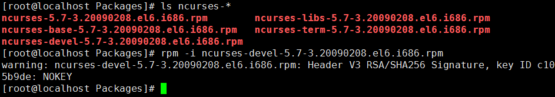

安装cmke、ncurses-devel、mysql

1、安装cmake（可以直接使用yum安装）
以下是.tar.gz包安装：
```bash
cd /root/data
tar -zxvf cmake-3.6.0.tar.gz
cd ./cmake-3.6.0
./bootstrap
gmake
gmake install
 
 
注意：cmake需要bootstrap进行配置。
 
./bootstrap：配置
gmake ：编译
gmake install ：安装
```

2、安装ncurses-devel（可以直接使用yum安装）
以下是rpm包安装：


3、mysql安装
```bash
cd /root/data
tar -zxvf mysql-5.5.17.tar.gz
cd mysql-5.5.17
 
cmake \
-DCMAKE_INSTALL_PREFIX=/usr/local/mysql \
-DMYSQL_DATADIR=/usr/local/mysql/data \
-DDEFAULT_CHARSET=utf8 \
-DDEFAULT_COLLATION=utf8_general_ci
 
make && make install
 
 
其中：
-DCMAKE_INSTALL_PREFIX：安装路径
-MYSQL_DATADIR：mysql的数据目录
-DDEFAULT_CHARSET：默认字符集
-DDEFAULT_COLLATION：默认排序方式
```

产生mysql配置文件（下述命令必须在mysql的解压目录中执行）：
shell>#cp support-files/my-medium.cnf /etc/my.cnf
```bash
Mysql用户组及权限设置：
useradd mysql
chmod u+x,g+x,o+x /usr/local/mysql
chown -R mysql.mysql /usr/local/mysql
 
chown –R mysql.mysql /usr/local/mysql
对/usr/local/mysql的目录和文件全部变更为所有者为mysql、所属组为mysql
```

```bash
在linux下装好mysql之后本身没有一些默认的数据，如test数据库。所以需要进行数据库的初始化操作。
数据库初始化：
/usr/local/mysql/scripts/mysql_install_db \
--user=mysql \
--basedir=/usr/local/mysql \
--datadir=/usr/local/mysql/data &
 
&符号，表示所在的命令后台执行。
卡屏时，按下回车键即可：
```

```bash
把mysql安装文件(除data)的所有者都改为root，避免数据库恢复为出厂设置：
chown -R root /usr/local/mysql  #将mysql安装目录递归全部改成root所有
chown -R mysql /usr/local/mysql/data #除了mysql/data目录之外
 
后台运行mysql服务，命令完成按下回车：
/usr/local/mysql/support-files/mysql.server start
```

如果报错：  
Starting MySQL. ERROR! The server quit without updating PID file (/var/lib/mysql/bogon.pid).  
解决办法其实很简单：将 /etc/mysql 下的 my.cnf 文件删除，再次启动MySQL服务。删除前注意备份   
