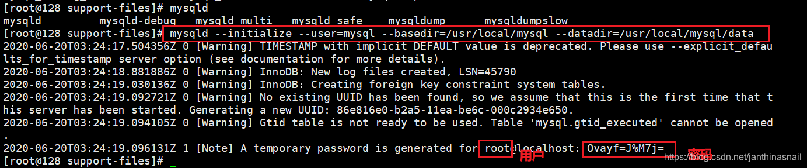
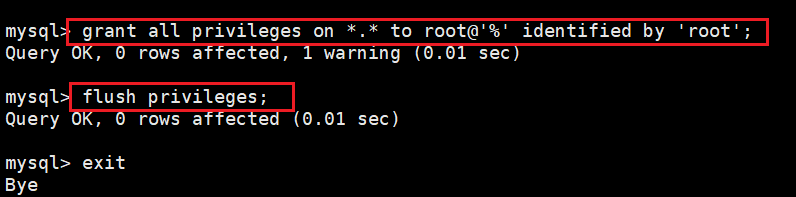

创建mysql用户
```bash
# 创建shell不能登陆的账号 且 不创建家目录的mysql账号
useradd -s /sbin/nologin -M mysql
```

下载mysql5.7并解压
```bash
# 下载mysql5.7
wget https://cdn.mysql.com//archives/mysql-5.7/mysql-5.7.18-linux-glibc2.5-x86_64.tar.gz
 
# 解压
tar -xf mysql-5.7.18-linux-glibc2.5-x86_64.tar.gz
 
# 重命名
mv mysql-5.7.18-linux-glibc2.5-x86_64.tar.gz mysql
 
# 移动到/usr/local目录下
mv mysql/ /usr/local/
 
cd /usr/local/mysql
 
# 创建数据目录/usr/local/mysql/data
mkdir data
 
# 修改mysql的用户及用户组
chown -R mysql.mysql /usr/local/mysql
 
# 创建/tmp/mysql目录并修改用户及用户组
mkdir /tmp/mysql
chown -R mysql.mysql /tmp/mysql
 
# 如果出现报错mysql.pid、mysql.sock文件，请创建
touch /tmp/mysql/mysql.pid;touch /tmp/mysql/mysql.sock;chown -R mysql.mysql /tmp/mysql
 
# 复制mysql.server文件到开机启动目录
cp -f /usr/local/mysql/support-files/mysql.server /etc/init.d/mysql
```

mysql配置文件（/etc/my.cnf）
```bash
# /etc/my.cnf文件配置如下
 
[mysql]
default-character-set=utf8
socket = /tmp/mysql/mysql.sock
 
[mysqld]
socket = /tmp/mysql/mysql.sock
character-set-server=utf8
basedir=/usr/local/mysql
datadir=/usr/local/mysql/data
port=3306
pid-file=/tmp/mysql/mysqld.pid 
 
############################################################################
#####################以下是做MHA的相关配置，可忽略以下###########################
# 四台node不可重复
server-id=101
log-bin=master-bin
relay-log-index=slave-relay-bin.index
relay-log=slave-relay-bin
binlog_format = MIXED
sync_binlog = 1
expire_logs_days =7 #二进制日志自动删除/过期的天数。默认值为0，表示不自动删除。 
log_slave_updates = 1 
binlog-do-db = test 
binlog-ignore-db = mysql,performance_schema,sys,information_schema 
replicate-do-db=test 
replicate-ignore-db=mysql,performance_schema,sys,information_schema
############################################################################
 
 
 
#
# include all files from the config directory
#
!includedir /etc/my.cnf.d
```

初始化mysql  
`mysqld --initialize --user=mysql --basedir=/usr/local/mysql --datadir=/usr/local/mysql/data`


启动mysql  
`systemctl start mysqld`


进入mysql修改密码  


创建远程可访问的账号（仅供测试使用）  


接下可以搭建主从或者MHA高可用......

参考：https://www.cnblogs.com/wendy-0901/p/12673705.html 
