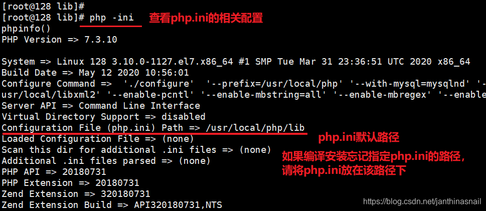

一、说明

1）编译安装libxml2、libmcrypt、mhash、mcrypt、libpng、jpeg6、freetype、php

2）phpize安装openssl、memcache、redis等扩展

二、编译安装

以下是解压.tar.gz文件，并进入对应的目录，然后相关进行操作

1、安装libxml2

./configure --prefix=/usr/local/libxml2

或者./configure --prefix=/usr/local/libxml2 --without-zlib

其中：--prefix：安装路径--without-zlib：不启用zlib库

2、安装libmcrypt

./configure --prefix=/usr/local/libmcrypt

安装 libltdl，也在 libmcrypt源码目录中，非新软件。接着继续进入libltdl目录

./configure --enable-ltdl-install

3、安装mhash

./configure

4、安装mcrypt

变量：LD_LIBRARY_PATH用于指定 libmcrypt和 mhash的库的位置

export LD_LIBRARY_PATH=/usr/local/libmcrypt/lib:/usr/local/lib

./configure --with-libmcrypt-prefix=/usr/local/libmcrypt

5、安装libpng

./configure --prefix=/usr/local/libpng

6、安装jpeg6

--enable-shared与--enable-static参数分别为建立共享库和静态库使用的 libtool

./configure --prefix=/usr/local/jpeg9/ --enable-shared --enable-static

7、安装freetype

./configure --prefix=/usr/local/freetype

PHP 会出现Configure: error: freetype.h not found 错误解决方法如下：

使用:yum install freetype-devel补充依赖包即可

8、安装php
```bash
【方式一】
./configure  \ 
--prefix=/usr/local/php/ \
--with-config-file-path=/usr/local/php/etc/ \     #指定配置文件目录
--with-apxs2=/usr/local/apache2/bin/apxs  \     #指定 apache动态模块位置
--with-libxml-dir=/usr/local/libxml2/ \     #指定 libxml位置
--with-jpeg-dir=/usr/local/jpeg9/  \     #指定 jpeg位置
--with-png-dir=/usr/local/libpng/ \     #指定 libpng位置
--with-freetype-dir=/usr/local/freetype/  \     #指定 freetype位
--with-mcrypt=/usr/local/libmcrypt/ \   #指定 libmcrypt位置
--with-gd \     #启用 gd库
--enable-soap \     #支持 soap服务(api)
--enable-mbstring=all \     #支持多字节，字符串
--enable-sockets  \     #支持套接字
--with-pdo-mysql=/usr/local/mysql  \    #启用 mysql的 pdo模块支持
--with-pdo-mysql=mysqlnd \     #Mysql Native Driver 简称:mysqlnd
--without-pear     #不安装 pear(Composer代替)
--enable-fpm     #安装php-fpm
 
 
【方式二】
./configure \
--prefix=/usr/local/php \
--with-apxs2=/usr/local/http2/bin/apxs \ #指定apache第三方编译的模块
--with-mysql=mysqlnd \ #指定mysql的扩展，mysqlnd为php官方的扩展库
--with-pdo-mysql=mysqlnd \ #指定mysql　pdo的扩展库
--with-mysqli=mysqlnd \ #指定mysql的扩展库
--with-freetype-dir=/usr/local/freetype \ #启用freetype字体库
--with-gd \ #启用gd扩展库
--with-zlib \ #启用zlib扩展库
--with-libxml-dir=/usr/local/libxml2 \ #启用libxml扩展库，并且指定安装路径
--with-jpeg-dir=/usr/local/jpeg \ #启用jpeg扩展库
--with-png-dir=/usr/local/libpng \ #启用png扩展库
--enable-mbstring=all \ #启用mbstring扩展库
--enable-mbregex \ #启用宽字节正则
--enable-shared \
--with-openssl-dir=/usr/local/openssl \ #启用openssl扩展库
--with-openssl
--enable-fpm     #安装php-fpm
```

PHP安装后需要调整相应配置文件和参数才能正常运行。  
1、生成 php配置文件  
mkdir /usr/local/php/etc  
cp /root/lamp/php-7.3.10/php.ini-production /usr/local/php/etc/php.ini  
或者是cp php.ini-development /usr/local/php/lib/php.ini  

如果安装php的时候忘记指定php.ini的文件目录，可以通过/usr/local/php/bin/php -ini查看相关配置，查看默认存放php.ini的路径，如下图所示：


如果只是临时加载配置文件，例如：/usr/local/php/bin/php -c /usr/local/php/etc/php.ini

2.修改 Apache配置文件，使其识别*.php文件，并能通过 php模块调用 php进行页面解析

vim /usr/local/apache2/etc/httpd.conf

AddType application/x-httpd-php .php

3.重启 Apache服务

/usr/local/apache2/bin/apachectl stop

/usr/local/apache2/bin/apachectl start

4.测试 php页面是否能正常解析（即 apache和 php连通性）

vim /usr/local/apache2/htdocs/test.php

<?php phpinfo();?>

通过浏览器输入地址访问：http://Apache服务器地址/test.php

9、补充

①安装gd

./configure \

--prefix=/usr/local/gd \ #gd安装位置

--with-jpeg=/usr/local/jpeg \ #启用jpeg扩展库

--with-png \ #启用png扩展库

--with-zlib \ #启用zlib扩展库

--with-freetype=/usr/local/freetype #启用freetype字体库

②安装openssl

./config --prefix=/usr/local/openssl

三、phpize安装扩展

1、安装opensssl
```bash
cd /root/lamp/php-7.3.10/ext
cd openssl/
mv  config0.m4  config.m4
/usr/local/php/bin/phpize
./configure --with-openssl --with-php-config=/usr/local/php/bin/php-config
make
make install
 
phpize是用来扩展php扩展模块的，通过phpize可以建立php的外挂模块。
yum -y install autoconf 执行phpize时生成configure文件。
Autoconf是一个用于生成shell脚本的工具，
可以自动配置软件源代码以适应多种类似POSIX的系统。
为了让你的软件包在所有的不同系统上都可以进行编译。
```

2、安装memcache
```bash
//以pecl-memcache-4.0.4.tar.gz为例
tar -xf pecl-memcache-4.0.4.tar.gz 
cd pecl-memcache-4.0.4
/usr/local/php/bin/phpize
./configure --with-php-config=/usr/local/php/bin/php-config
make
make install
 
 
修改php.ini配置
使其识别并调用 openssl和 memcache两个模块
vi /usr/local/php/etc/php.ini
extension_dir="/usr/local/php/lib/php/extensions/no-debug-zts-20180731/"
 
取消分号注释，并添加以上路径（此路径来自于模块安装命令的结果）
extension="openssl.so";
extension="memcache.so";
 
添加以上两个库文件的调用。
重启 apache，刷新 phpinfo 页面，并查看是否有两个新增的模块
```

3、安装redis
```bash
unzip phpredis-develop.zip 
cd  /root/lamp/phpredis-develop
/usr/local/php/bin/phpize
./configure --with-php-config=/usr/local/php/bin/php-config
make
make install
 
 
vi /usr/local/php/etc/php.ini
extension_dir="/usr/local/php/lib/php/extensions/no-debug-zts-20180731/"
 
extension="openssl.so";
extension="memcache.so";
extension="redis.so";
```

四、安装memcache、redis服务

1、安装memcache服务
```bash
MemCache用到了libevent库，libevent是安装MemCache的唯一前提条件，
是一套跨平台的事件处理接口的封装，memcached使用libevent来进行网络并发连接的处理，
能够在很大并发的情况下，仍旧保持快速的响应能力。
tar -xf memcached-1.5.19.tar.gz 
 
yum -y install libevent-devel
cd /root/lamp/memcached-1.5.19
./configure --prefix=/usr/local/memcache
make
make install
useradd -r -s /sbin/nologin memcache
 
添加 memcache用户，此用户不用登录，不设置密码
/usr/local/memcache/bin/memcached -umemcache &
 
启动 memcache服务，并设置为后台运行
netstat -an | grep :11211
```

2、安装redis服务
```bash
//以redis-5.0.6.tar.gz为例
tar -xf redis-5.0.6.tar.gz 
cd /root/lamp/redis-5.0.6
//安装
make
cd src
make install PREFIX=/usr/local/redis
 
//移动配置文件到安装目录下
cd  /root/lamp/redis-5.0.6
mkdir /usr/local/redis/etc
mv redis.conf /usr/local/redis/etc
 
//配置redis为后台启动
vi /usr/local/redis/etc/redis.conf
 
//将daemonize no 改成daemonize yes
 
 
//开启redis
/usr/local/redis/bin/redis-server /usr/local/redis/etc/redis.conf 
```

如果报错：You need tcl 8.5 or newer in order to run the Redis test  
请安装tcl8.5以上的版本  

五、常见安装报错  
详见：[php源代码安装常见错误与解决办法分享](https://www.jb51.net/article/37487.htm)
