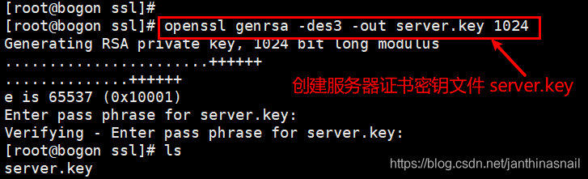
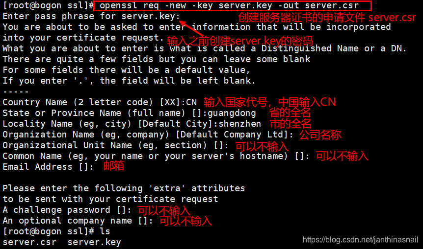
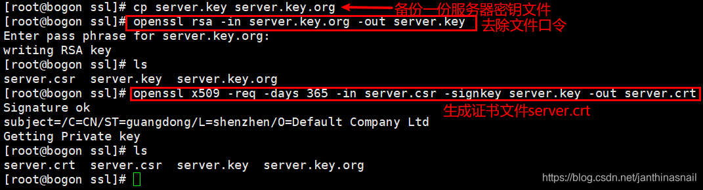
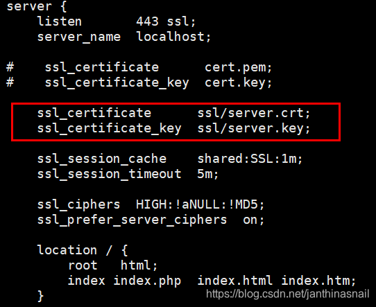
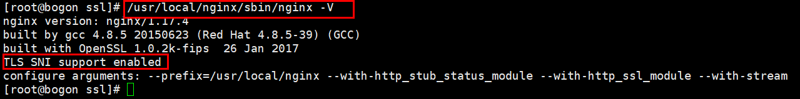
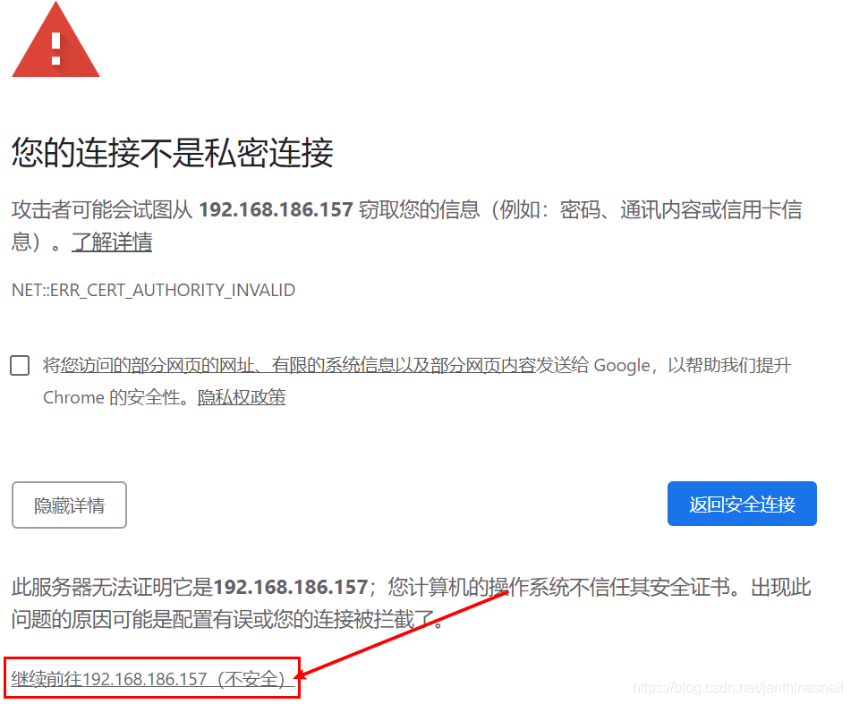

1、生成https的证书和私钥（如果没有openssl，直接通过yum安装）
```bash
①cd /usr/local/nginx/conf  //切换到nginx配置文件的目录下
②mkdir ssl  //创建ssl目录
③openssl genrsa -des3 -out server.key 1024  //创建服务器证书密钥文件 server.key，此处需要输入密码和确认密码

④openssl req -new -key server.key -out server.csr  //创建服务器证书的申请文件 server.csr
⑤cp server.key server.key.org  //备份一份服务器密钥文件

⑥openssl rsa -in server.key.org -out server.key  //去除文件口令

⑦openssl x509 -req -days 365 -in server.csr -signkey server.key -out server.crt  //生成证书文件server.crt
```

  
  
  

2、nginx  
因为之前已经把nginx配置安装好，不清楚可以在网上查找nginx的配置安装及启动等。  
nginx.conf的https配置，如图：  
  
启动nginx，查看nginx模块，/usr/local/nginx/sbin/nginx -V。如下图，说明已经添加了。  
    

3、网页访问（因为是虚拟机，动态的ip地址，https://192.168.186.157）  
  

详见：https://blog.csdn.net/qq_22385935/article/details/91990876
