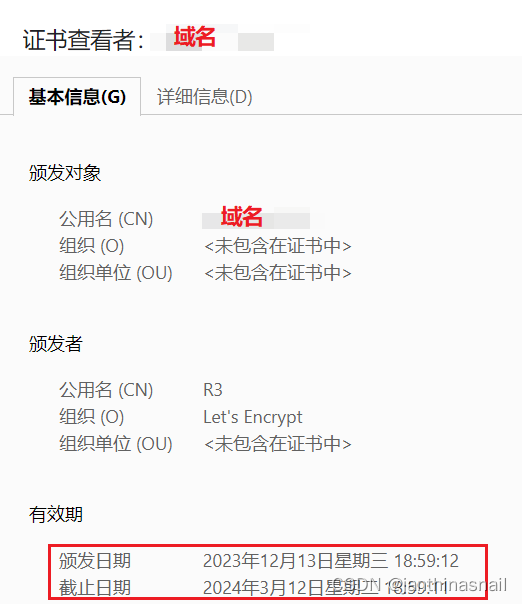

Let's Encrypt官网：https://letsencrypt.org/


Certbot官网：https://certbot.eff.org/

1、域名控制台添加域名，如test.example.com

2、在服务器添加nginx配置，test.example.com.conf文件内容如下

```
# test.example.com.conf配置
 
server {
    listen       80;
    server_name  test.example.com;
 
    location / {
        root   html/example;
        index  index.html index.htm;
    }
}
```

3、重启nginx
`nginx -s reload`

4、curl访问
`curl test.example.com`

5、访问[入门指南 - Let's Encrypt - 免费的SSL/TLS证书](https://letsencrypt.org/zh-cn/getting-started/)，我们发现可以使用[Certbot](https://certbot.eff.org/)工具进行操作

在Certbot页面填写HTTP website的运行环境，如[Certbot Instructions | Certbot](https://certbot.eff.org/instructions?ws=nginx&os=centosrhel7)

根据上面的步骤，依次安装snapd、Certbot

```bash
# 安装snapd，见https://snapcraft.io/docs/installing-snap-on-centos
yum install snapd
systemctl enable --now snapd.socket
ln -s /var/lib/snapd/snap /snap
 
 
# 安装Certbot
snap install --classic certbot
ln -s /snap/bin/certbot /usr/bin/certbot
```
6、申请证书
```bash
certbot certonly -a manual -i nginx -d test.example.com
 
 
# 1、说明
# 详见：https://eff-certbot.readthedocs.io/en/latest/using.html#nginx
# 
# certonly：只生成证书，后续自行配置
# -a 或 --authenticator：
# -i 或 --installer：
# -d 或 --domains：域名
# --nginx-server-root 可以指定nginx配置文件路径，默认: /etc/nginx 或 /usr/local/etc/nginx
# --webroot-path，简写-w，项目目录
 
 
# 2、补充
# 执行上述命令可能需要填写邮箱地址
```

6、申请证书
```bash
certbot certonly -a manual -i nginx -d test.example.com
 
 
# 1、说明
# 详见：https://eff-certbot.readthedocs.io/en/latest/using.html#nginx
# 
# certonly：只生成证书，后续自行配置
# -a 或 --authenticator：
# -i 或 --installer：
# -d 或 --domains：域名
# --nginx-server-root 可以指定nginx配置文件路径，默认: /etc/nginx 或 /usr/local/etc/nginx
# --webroot-path，简写-w，项目目录
 
 
# 2、补充
# 执行上述命令可能需要填写邮箱地址
```

返回结果
```bash
Saving debug log to /var/log/letsencrypt/letsencrypt.log
Requesting a certificate for test.example.com
 
- - - - - - - - - - - - - - - - - - - - - - - - - - - - - - - - - - - - - - - -
Create a file containing just this data:
 
zi4-Q2V2Kbr31z1DkmeqlAqFvdaBoKkc0fRI_hMak6A.a8QL3dhhRI6nKqWSrmSGWWYjRocjtI6ew0Xh1rVkRoA
 
And make it available on your web server at this URL:
 
http://test.example.com/.well-known/acme-challenge/zi4-Q2V2Kbr31z1DkmeqlAqFvdaBoKkc0fRI_hMak6A
 
- - - - - - - - - - - - - - - - - - - - - - - - - - - - - - - - - - - - - - - -
Press Enter to Continue
```

根据返回的结果，需要在项目所在的路径创建.well-known/acme-challenge/zi4-Q2V2Kbr31z1DkmeqlAqFvdaBoKkc0fRI_hMak6A这个文件，内容为zi4-Q2V2Kbr31z1DkmeqlAqFvdaBoKkc0fRI_hMak6A.a8QL3dhhRI6nKqWSrmSGWWYjRocjtI6ew0Xh1rVkRoA

```bash
# 进入项目目录
cd html/example
 
# 创建目录、文件
mkdir -p .well-known/acme-challenge
touch .well-known/acme-challenge/zi4-Q2V2Kbr31z1DkmeqlAqFvdaBoKkc0fRI_hMak6A
 
# zi4-Q2V2Kbr31z1DkmeqlAqFvdaBoKkc0fRI_hMak6A文件内容
# zi4-Q2V2Kbr31z1DkmeqlAqFvdaBoKkc0fRI_hMak6A.a8QL3dhhRI6nKqWSrmSGWWYjRocjtI6ew0Xh1rVkRoA
```

然后按任意键（Press Enter to Continue）

返回结果

```bash
Successfully received certificate.
Certificate is saved at: /etc/letsencrypt/live/test.example.com/fullchain.pem
Key is saved at:         /etc/letsencrypt/live/test.example.com/privkey.pem
This certificate expires on 2024-03-12.
These files will be updated when the certificate renews.
 
NEXT STEPS:
- This certificate will not be renewed automatically. Autorenewal of --manual certificates requires the use of an authentication hook script (--manual-auth-hook) but one was not provided. To renew this certificate, repeat this same certbot command before the certificate's expiry date.
- - - - - - - - - - - - - - - - - - - - - - - - - - - - - - - - - - - - - - - -
If you like Certbot, please consider supporting our work by:
 * Donating to ISRG / Let's Encrypt:   https://letsencrypt.org/donate
 * Donating to EFF:                    https://eff.org/donate-le
- - - - - - - - - - - - - - - - - - - - - - - - - - - - - - - - - - - - - - - -
```

到此，证书申请成功

7、nginx配置ssl证书
```bash
# test.example.com.conf配置
 
server {
    listen       80;
    server_name  test.example.com;
 
    # 监听443端口
    listen 443 ssl;
 
    # 配置ssl证书
    # nginx的ssl证书配置参考：https://cloud.tencent.com/document/product/400/35244
    ssl_certificate /etc/letsencrypt/live/test.example.com/fullchain.pem;
    ssl_certificate_key /etc/letsencrypt/live/test.example.com/privkey.pem;
 
    ssl_session_timeout 5m;
    ssl_protocols TLSv1.2 TLSv1.3;
    ssl_ciphers ECDHE-RSA-AES128-GCM-SHA256:HIGH:!aNULL:!MD5:!RC4:!DHE;
    ssl_prefer_server_ciphers on;
 
 
    location / {
        root   html/example;
        index  index.html index.htm;
    }
}
```

8、重启nginx
`nginx -s reload`

9、浏览器访问https://test.example.com，并查看证书信息


10、有效期有限，添加定时任务更新，定时任务执行命令：certbot renew --dry-run

11、申请letsencrypt通配符证书

[技术干货 024｜如何免费申请通配SSL证书 - 知乎](https://zhuanlan.zhihu.com/p/438161610)

参考：

[Welcome to the Certbot documentation! — Certbot 2.7.0.dev0 documentation](https://eff-certbot.readthedocs.io/)  
[手把手教你搭建基于 Let’s Encrypt 的免费 HTTPS 证书 - 简书](https://www.jianshu.com/p/575cbfefdf1f)  
[申请 Let'sEncrypt 证书 - 博客园](https://www.cnblogs.com/haoee/p/16284491.html)  
[SSL 证书 Nginx 服务器 SSL 证书安装部署-证书安装-文档中心-腾讯云](https://cloud.tencent.com/document/product/400/35244)  
[技术干货 024｜如何免费申请通配SSL证书 - 知乎](https://zhuanlan.zhihu.com/p/438161610)  
