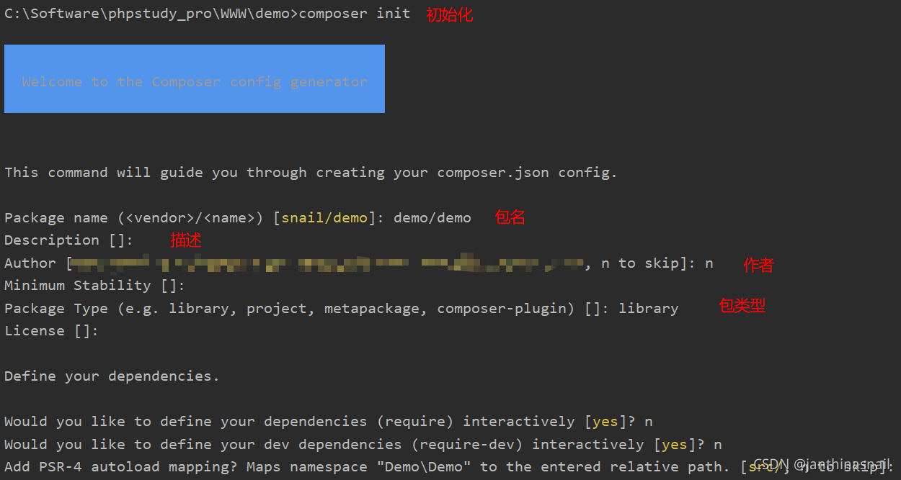
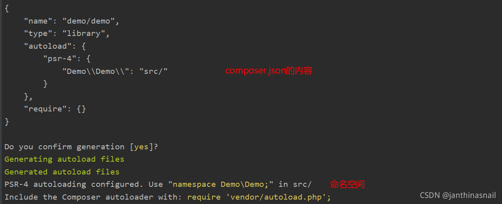

## 简单分析composer如何自动加载文件

1、使用composer init 进行初始化，如下图所示：



目录结构如图所示：


2、从vendor/autoload.php开始分析
```php
<?php
// autoload.php文件
// autoload.php @generated by Composer
 
// 引入autoload_real.php文件
require_once __DIR__ . '/composer/autoload_real.php'; 
 
// 调用getLoader方法，接下来我们直接从这个方法开始，分析如何加载类文件
return ComposerAutoloaderInit6123050cbfe39c30c2c64e101f1dfb9c::getLoader();
```

我们发现autoload.php文件引入了vendor/composer/autoload_real.php文件
```php
<?php
// autoload_real.php文件
// autoload_real.php @generated by Composer
 
class ComposerAutoloaderInit6123050cbfe39c30c2c64e101f1dfb9c
{
    // 静态属性
    private static $loader;
 
    // 类似_autoload($class)的用法，然后加载类文件
    public static function loadClassLoader($class)
    {
        if ('Composer\Autoload\ClassLoader' === $class) {
            require __DIR__ . '/ClassLoader.php';
        }
    }
 
    /**
     * @return \Composer\Autoload\ClassLoader
     */
    public static function getLoader()
    {
        // 静态属性$loader如果不为null，直接返回，否则执行下面代码
        if (null !== self::$loader) {
            return self::$loader;
        }
 
        spl_autoload_register(array('ComposerAutoloaderInit6123050cbfe39c30c2c64e101f1dfb9c', 'loadClassLoader'), true, true);
        // 当实例化\Composer\Autoload\ClassLoader时候，由于当前文件不存在该类，
        // 通过上面注册loadClassLoader方法去加载\Composer\Autoload\ClassLoader类所在的文件
        self::$loader = $loader = new \Composer\Autoload\ClassLoader(\dirname(\dirname(__FILE__)));
        spl_autoload_unregister(array('ComposerAutoloaderInit6123050cbfe39c30c2c64e101f1dfb9c', 'loadClassLoader'));
 
        $useStaticLoader = PHP_VERSION_ID >= 50600 && !defined('HHVM_VERSION') && (!function_exists('zend_loader_file_encoded') || !zend_loader_file_encoded());
        if ($useStaticLoader) {
            require __DIR__ . '/autoload_static.php';
 
            call_user_func(\Composer\Autoload\ComposerStaticInit6123050cbfe39c30c2c64e101f1dfb9c::getInitializer($loader));
        } else {
            $map = require __DIR__ . '/autoload_namespaces.php';
            foreach ($map as $namespace => $path) {
                $loader->set($namespace, $path);
            }
 
            $map = require __DIR__ . '/autoload_psr4.php';
            foreach ($map as $namespace => $path) {
                $loader->setPsr4($namespace, $path);
            }
 
            $classMap = require __DIR__ . '/autoload_classmap.php';
            if ($classMap) {
                $loader->addClassMap($classMap);
            }
        }
 
        $loader->register(true);
 
        return $loader;
    }
}
```

3、从getLoader方法开始分析如何加载类文件
```
spl_autoload_register($autoload_function ,$throw=true,$prepend= false)函数

autoload_function：欲注册的自动装载函数。如果没有提供任何参数，则自动注册 autoload 的默认实现函数[spl_autoload()](https://www.php.net/manual/zh/function.spl-autoload.php)。

throw：此参数设置了 autoload_function 无法成功注册时， spl_autoload_register()是否抛出异常。

prepend：如果是 true，spl_autoload_register() 会添加函数到队列之首，而不是队列尾部。

详见：[PHP: spl_autoload_register - Manual](https://www.php.net/manual/zh/function.spl-autoload-register.php)
```

所以，这段代码在注册ComposerAutoloaderInitxxx的loadClassLoader方法
```php
spl_autoload_register(array('ComposerAutoloaderInit6123050cbfe39c30c2c64e101f1dfb9c', 'loadClassLoader'), true, true);
```

其中loadClassLoader($class)方法和spl_autoload_register给的示例代码类似（如下图所示），主要是加载ClassLoader.php文件


```php
// 对下面这行代码做简单说明：
 
// 实例化\Composer\Autoload\ClassLoader这个的时候，
// 因为已经注册了loadClassLoader方法，所以会自动加载ClassLoader.php文件。
 
// \dirname(\dirname(__FILE__))即为vendor目录
 
self::$loader = $loader = new \Composer\Autoload\ClassLoader(\dirname(\dirname(__FILE__)));
 
// 注销已注册的 __autoload() 函数
spl_autoload_unregister(array('ComposerAutoloaderInit6123050cbfe39c30c2c64e101f1dfb9c', 'loadClassLoader'));
```

判断是否使用静态加载
```php
// PHP_VERSION_ID：php版本
// HHVM_VERSION：
// zend_loader_file_encoded：
 
// 从单词的意思上，应该是在判断是否使用静态加载
$useStaticLoader = PHP_VERSION_ID >= 50600 && !defined('HHVM_VERSION') && (!function_exists('zend_loader_file_encoded') || !zend_loader_file_encoded());
```

如果$useStaticLoader为true，加载autoload_static.php文件；否则，加载autoload_namespaces.php、autoload_psr4.php、autoload_classmap.php文件。

最后执行调用注册方法
```php
// 调用\Composer\Autoload\ClassLoader下的register方法
// self::$loader = $loader = new \Composer\Autoload\ClassLoader(\dirname(\dirname(__FILE__)));
 
$loader->register(true);
```

4、分析ClassLoader.php

在autoload_real.php,实例化Composer\Autoload\ClassLoader类时，自动加载类文件
```php
// 类似_autoload($class)的用法，然后加载类文件
public static function loadClassLoader($class)
{
    if ('Composer\Autoload\ClassLoader' === $class) {
        // 加载ClassLoader.php类文件
        require __DIR__ . '/ClassLoader.php';
    }
}
```

由于ClassLoader.php代码有点多，找主要的分析一下：

set方法
```php
public function set($prefix, $paths)
{
    if (!$prefix) {
        $this->fallbackDirsPsr0 = (array) $paths;
    } else {
        $this->prefixesPsr0[$prefix[0]][$prefix] = (array) $paths;
    }
}
```

setPsr4方法
```php
public function setPsr4($prefix, $paths)
{
    if (!$prefix) {
        $this->fallbackDirsPsr4 = (array) $paths;
    } else {
        // 获取命名空间的长度
        $length = strlen($prefix);
        // 判断是否以\结尾
        if ('\\' !== $prefix[$length - 1]) {
            throw new \InvalidArgumentException("A non-empty PSR-4 prefix must end with a namespace separator.");
        }
        // $prefix[0]是命名空间的第一个字符
        $this->prefixLengthsPsr4[$prefix[0]][$prefix] = $length;
        $this->prefixDirsPsr4[$prefix] = (array) $paths;
    }
}
```

addClassMap方法
```php
public function addClassMap(array $classMap)
{
    if ($this->classMap) {
        $this->classMap = array_merge($this->classMap, $classMap);
    } else {
        $this->classMap = $classMap;
    }
}
```

register方法
```php
public function register($prepend = false)
{
    // 自动注册当前类的loadClass方法
    spl_autoload_register(array($this, 'loadClass'), true, $prepend);
 
    // 判断vendorDir是否为null
    if (null === $this->vendorDir) {
        return;
    }
 
    if ($prepend) {
        // 注意：区分 array_merge 和 + 的数组操作
        self::$registeredLoaders = array($this->vendorDir => $this) + self::$registeredLoaders;
    } else {
        unset(self::$registeredLoaders[$this->vendorDir]);
        self::$registeredLoaders[$this->vendorDir] = $this;
    }
}
```

其中spl_autoload_register(array($this, 'loadClass'), true, $prepend)注册了loadClass方法

当实例化其他类的时候（比如我们使用composer require xxx，然后实例化xxx类），会调用loadClass方法，然后加载相关文件

```php
// 类似autoload_real.php文件中的loadClassLoader方法
 
public function loadClass($class)
{
    if ($file = $this->findFile($class)) {
        includeFile($file); // include $file;
 
        return true;
    }
 
    return null;
}
```

我们再来看看findFile方法
```php
public function findFile($class)
{
    // class map lookup
    // 首先查找classMap数组中是否有这个 类=>文件路径 ，存在就直接返回
    if (isset($this->classMap[$class])) {
        return $this->classMap[$class];
    }
    if ($this->classMapAuthoritative || isset($this->missingClasses[$class])) {
        return false;
    }
    if (null !== $this->apcuPrefix) {
        $file = apcu_fetch($this->apcuPrefix.$class, $hit);
        if ($hit) {
            return $file;
        }
    }
 
    $file = $this->findFileWithExtension($class, '.php');
 
    // Search for Hack files if we are running on HHVM
    if (false === $file && defined('HHVM_VERSION')) {
        $file = $this->findFileWithExtension($class, '.hh');
    }
 
    if (null !== $this->apcuPrefix) {
        apcu_add($this->apcuPrefix.$class, $file);
    }
 
    if (false === $file) {
        // Remember that this class does not exist.
        $this->missingClasses[$class] = true;
    }
 
    return $file;
}
```

findFileWithExtension方法，主要找到对应文件，并判断文件是否存在
```php
private function findFileWithExtension($class, $ext)
{
    // PSR-4 lookup
    // strtr转换指定字符，将 \\ 转换成文件分隔符 \
    // 比如：$class = 'Demo\Demo\Test';
    // $logicalPathPsr4 = 'Demo\Demo\Test.php';
    $logicalPathPsr4 = strtr($class, '\\', DIRECTORY_SEPARATOR) . $ext;
 
    // 获取类名的第一个字符
    $first = $class[0];
    if (isset($this->prefixLengthsPsr4[$first])) {
        $subPath = $class;
        // 判断类名是否含有\\
        while (false !== $lastPos = strrpos($subPath, '\\')) {
            $subPath = substr($subPath, 0, $lastPos);
            $search = $subPath . '\\';
            if (isset($this->prefixDirsPsr4[$search])) {
                $pathEnd = DIRECTORY_SEPARATOR . substr($logicalPathPsr4, $lastPos + 1);
                foreach ($this->prefixDirsPsr4[$search] as $dir) {
                    if (file_exists($file = $dir . $pathEnd)) {
                        return $file;
                    }
                }
            }
        }
    }
 
    // PSR-4 fallback dirs
    foreach ($this->fallbackDirsPsr4 as $dir) {
        // 处理文件路径 并 判断文件是否存在
        if (file_exists($file = $dir . DIRECTORY_SEPARATOR . $logicalPathPsr4)) {
            return $file;
        }
    }
 
    // PSR-0 lookup
    // 判断类名是否含有\\
    if (false !== $pos = strrpos($class, '\\')) {
        // namespaced class name
        $logicalPathPsr0 = substr($logicalPathPsr4, 0, $pos + 1)
            . strtr(substr($logicalPathPsr4, $pos + 1), '_', DIRECTORY_SEPARATOR);
    } else {
        // PEAR-like class name
        // strtr转换指定字符，将 _ 转换成文件分隔符 \
        $logicalPathPsr0 = strtr($class, '_', DIRECTORY_SEPARATOR) . $ext;
    }
 
    if (isset($this->prefixesPsr0[$first])) {
        foreach ($this->prefixesPsr0[$first] as $prefix => $dirs) {
            if (0 === strpos($class, $prefix)) {
                foreach ($dirs as $dir) {
                    // 处理文件路径 并 判断文件是否存在
                    if (file_exists($file = $dir . DIRECTORY_SEPARATOR . $logicalPathPsr0)) {
                        return $file;
                    }
                }
            }
        }
    }
 
    // PSR-0 fallback dirs
    foreach ($this->fallbackDirsPsr0 as $dir) {
        if (file_exists($file = $dir . DIRECTORY_SEPARATOR . $logicalPathPsr0)) {
            return $file;
        }
    }
 
    // PSR-0 include paths.
    if ($this->useIncludePath && $file = stream_resolve_include_path($logicalPathPsr0)) {
        return $file;
    }
 
    return false;
}
```

在autoload_real.php打印$loader的属性信息
```php
<?php
// autoload_real.php @generated by Composer
// ...
$loader->register(true);
 
// 打印以下内容
// psr0
var_dump($loader->getPrefixes(),$loader->getFallbackDirs());
 
// psr4
var_dump($loader->getPrefixesPsr4(),$loader->getFallbackDirsPsr4());
 
// 直接添加 '命名空间+类名'=>'文件路径'
var_dump($loader->getClassMap());
        
return $loader;
```

打印信息如图所示：


5、分析autoload_static.php
```php
<?php
 
// autoload_static.php @generated by Composer
 
// 命名空间
namespace Composer\Autoload;
 
class ComposerStaticInit6123050cbfe39c30c2c64e101f1dfb9c
{
    // '命名空间+类名'的首字母 => array('命名空间+类名' => '命名空间+类名'字符长度)
    public static $prefixLengthsPsr4 = array (
        'D' => 
        array (
            'Demo\\Demo\\' => 10,
        ),
    );
 
    // '命名空间+类名' 对应 目录
    public static $prefixDirsPsr4 = array (
        'Demo\\Demo\\' => 
        array (
            0 => __DIR__ . '/../..' . '/src',
        ),
    );
 
    // '命名空间+类名' 对应 文件
    public static $classMap = array (
        'Composer\\InstalledVersions' => __DIR__ . '/..' . '/composer/InstalledVersions.php',
    );
 
    public static function getInitializer(ClassLoader $loader)
    {
        return \Closure::bind(function () use ($loader) {
            $loader->prefixLengthsPsr4 = ComposerStaticInit6123050cbfe39c30c2c64e101f1dfb9c::$prefixLengthsPsr4;
            $loader->prefixDirsPsr4 = ComposerStaticInit6123050cbfe39c30c2c64e101f1dfb9c::$prefixDirsPsr4;
            $loader->classMap = ComposerStaticInit6123050cbfe39c30c2c64e101f1dfb9c::$classMap;
 
        }, null, ClassLoader::class);
    }
}
```

```
Closure::bind复制一个闭包，绑定指定的$this对象和类作用域。

closure：需要绑定的匿名函数。

newThis：需要绑定到匿名函数的对象，或者 null 创建未绑定的闭包。

newScope：想要绑定给闭包的类作用域，或者 'static' 表示不改变。如果传入一个对象，则使用这个对象的类型名。 类作用域用来决定在闭包中 $this 对象的 私有、保护方法 的可见性。 详见：[PHP: Closure::bind - Manual](https://www.php.net/manual/zh/closure.bind.php)
```

在autoload_real.php文件中，通过call_user_func来调用getInitializer方法
```php
// autoload_real.php @generated by Composer
 
require __DIR__ . '/autoload_static.php';
call_user_func(\Composer\Autoload\ComposerStaticInit6123050cbfe39c30c2c64e101f1dfb9c::getInitializer($loader));
```

```
call_user_func把第一个参数作为回调函数调用

callback：将被调用的回调函数（[callable](https://www.php.net/manual/zh/language.types.callable.php)）。

parameter：0个或以上的参数，被传入回调函数。

详见：[PHP: call_user_func - Manual](https://www.php.net/manual/zh/function.call-user-func.php)
```

6、分析autoload_namespaces.php（可以直接跳过）
```php
<?php
 
// autoload_namespaces.php @generated by Composer
 
// vendor目录
$vendorDir = dirname(dirname(__FILE__));
 
// vendor所在的目录
$baseDir = dirname($vendorDir);
 
return array(
);
```

在autoload_real.php文件中，接收autoload_namespaces.php返回值，并进行循环遍历，处理命名空间与文件路径
```php
// autoload_real.php @generated by Composer
 
$map = require __DIR__ . '/autoload_namespaces.php';
foreach ($map as $namespace => $path) {
    $loader->set($namespace, $path);
}
```

7、分析autoload_psr4.php（可以直接跳过）
```php
<?php
 
// autoload_psr4.php @generated by Composer
 
// vendor目录
$vendorDir = dirname(dirname(__FILE__));
 
// vendor所在的目录
$baseDir = dirname($vendorDir);
 
return array(
    // 命名空间 对应 目录
    'Demo\\Demo\\' => array($baseDir . '/src'),
);
```

在autoload_real.php文件中，接收autoload_psr4.php返回值，并进行循环遍历，处理命名空间与文件路径
```php
// autoload_real.php @generated by Composer
 
$map = require __DIR__ . '/autoload_psr4.php';
foreach ($map as $namespace => $path) {
    $loader->setPsr4($namespace, $path);
}
```

8、分析autoload_classmap.php（可以直接跳过）
```php
<?php
 
// autoload_classmap.php @generated by Composer
 
// vendor目录
$vendorDir = dirname(dirname(__FILE__));
 
// vendor所在的目录
$baseDir = dirname($vendorDir);
 
return array(
    // 命名空间 对应 文件
    // 但是我们发现，目录并没有该文件，所以我们需要执行composer update
    'Composer\\InstalledVersions' => $vendorDir . '/composer/InstalledVersions.php',
);
```

在autoload_real.php文件中，接收autoload_classmap.php返回值
```php
// autoload_real.php @generated by Composer
 
$classMap = require __DIR__ . '/autoload_classmap.php';
if ($classMap) {
    $loader->addClassMap($classMap);
}
```

我们发现并没有InstalledVersions.php这个文件，所以我们需要执行composer udpate


InstalledVersions.php文件处理 installed.php 等相关信息， installed.php内容如下：
```php
<?php return array(
    'root' => array(
        'pretty_version' => '1.0.0+no-version-set',
        'version' => '1.0.0.0',
        'type' => 'library',
        'install_path' => __DIR__ . '/../../',
        'aliases' => array(),
        'reference' => NULL,
        'name' => 'demo/demo',
        'dev' => true,
    ),
    'versions' => array(
        'demo/demo' => array(
            'pretty_version' => '1.0.0+no-version-set',
            'version' => '1.0.0.0',
            'type' => 'library',
            'install_path' => __DIR__ . '/../../',
            'aliases' => array(),
            'reference' => NULL,
            'dev_requirement' => false,
        ),
    ),
);
```

以上是简单分析了下composer如何加载文件,有些不清楚的地方还是需要编写相关代码，添加断点等方式（比如在源码中var_dump打印结果）去查看运行结果更加直观。
