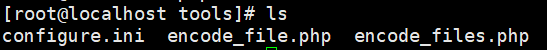
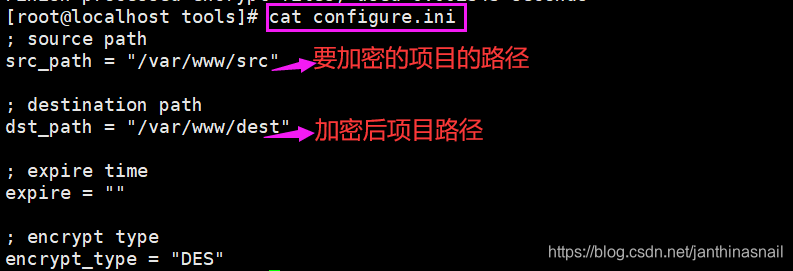
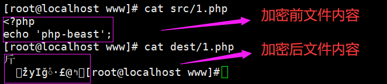
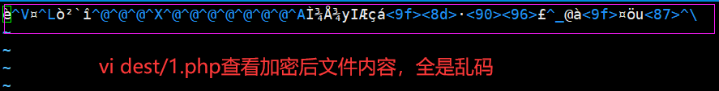

为了php代码安全，一般会对代码进行加密，防止因为别人篡改，导致代码无法正常运行。

偶然发现前辈对项目进行了混淆处理，之前因为水平有限，没怎么去关注这方面的技术。

后来每次项目提测，想要在centos环境上对php源码进行调试，看到的全是加密的代码，一点也不利于调试。

这些加密的代码见的次数多了，未免会有些好奇。

接下来，网上搜了一些资料，php混淆有Zend Guard、ionCube PHP Encode、Swoole Compiler、PHP Screw、PHP Screw plus、PHP Beast等这些混淆方式，前3种收费，后3种免费。

除了这些，可能还有其他方式。其中，PHP Screw这个方式，文章说已有破解方法，所以不研究PHP Screw和PHP Screw plus以及前3种收费的这几种方式。

最终选择PHP Beast混淆方式进行研究。github地址：https://github.com/liexusong/php-beast

1、以下是基于已经装好的php上安装PHP Beast扩展，进行编译安装，并配置php.ini，启动php-fpm

【注】以下是我在PHP 7.3.10进行测试

```bash
# 下载安装包
wget https://github.com/liexusong/php-beast/archive/master.zip
 
# 解压
unzip master.zip
 
# 进入解压目录
cd php-beast-master
 
# 指定phpize，根据具体的phpize路径，执行phpize之后，会生成configure可执行文件
/usr/local/php/bin/phpizeconfigure
 
# 编译并安装
./configure --with-php-config=/usr/local/php/bin/php-config 
make && make install
 
# 执行make && make install之后，会出现下面信息：
# Installing shared extensions: /usr/local/php/lib/php/extensions/no-debug-non-zts-20180731/
 
# 找到php.ini配置，添加以下代码
extension_dir=/usr/local/php/lib/php/extensions/no-debug-non-zts-20180731
extension=beast.so
 
# 启动php-fpm
/usr/local/php/sbin/php-fpm
# 如果不行，请指定php.ini和php-fpm的配置文件启动php-fpm
/usr/local/php/sbin/php-fpm -c /usr/local/php/etc/php.ini -y /usr/local/php/etc/php-fpm.conf
 
# 如果是已经启动的php-fpm，请先kill，然后启动
ps aux|grep php
kill具体的php-fpm进行id
/usr/local/php/sbin/php-fpm
 
# 正常情况使用以下命令可以查看是否安装好了beast扩展
php -m
# 如果不能查看，请使用以下命令
php -c /usr/local/php/etc/php.ini -m|grep beast
```

2、回到我们解压php-beast的目录，进行tools目录，能看到以下三个文件


具体操作见原文档：https://github.com/liexusong/php-beast#%E6%80%8E%E4%B9%88%E5%8A%A0%E5%AF%86%E9%A1%B9%E7%9B%AE


之前好久安装的php，忘了配置什么了，之后添加的扩展，有依赖这些后来添加扩展的，现在必须指定配置文件路径才能执行php脚本。
执行php-beast加密命令：php -c /usr/local/php/etc/php.ini  encode_files.php，查看效果如下：




详见：  
https://blog.csdn.net/qiuziqiqi/article/details/91389926  
https://github.com/liexusong/php-beast  
